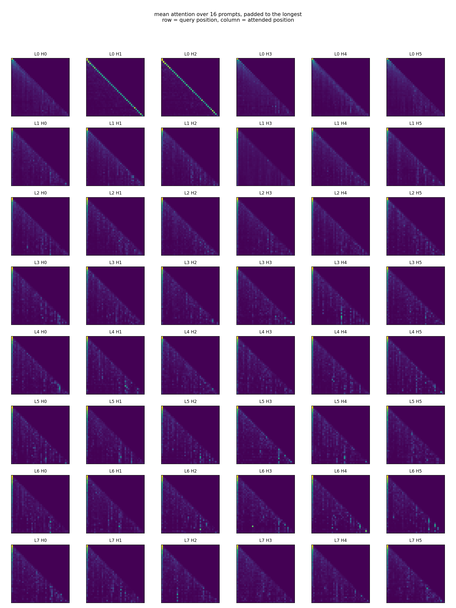

# LanguageModels

gh repo create LanguageModels --public --source=. --pushTwo language models trained on my own WhatsApp and Instagram messages:

1. **From scratch** — a ~50M parameter decoder-only transformer (GPT-style), written in plain PyTorch and trained on the raw messages which I built following the Andrej Karpathy Tutorial.
2. **Fine-tuned** — [Ministral-8B-Instruct](https://huggingface.co/mlx-community/Ministral-8B-Instruct-2410-4bit) fine-tuned with LoRA on QA pairs extracted from my chats, using [mlx-lm](https://github.com/ml-explore/mlx-lm) on Apple Silicon.

The training data itself is personal and is not included in this repo — only the code and the trained weights. You can play around with the models and see what 'knowledge' they have in the weights!

## Project structure

```
bigram.py              from-scratch transformer: model definition + training loop
run_from_scratch.py    interactive REPL for the from-scratch model
run_fine_tuned.py      interactive REPL for the LoRA fine-tuned Ministral-8B
lora_config.yaml       mlx-lm LoRA training configuration
attention.py           attention visualization experiment (see attention.html)
bigram_archive/        earlier versions of the from-scratch model (v1–v3)
adapters/              final LoRA adapter weights + config
data/                  data extraction/processing scripts (raw data not included)
```

## From-scratch model

Decoder-only transformer, roughly following Karpathy's *"Let's build GPT"*, but using the GPT-2 BPE tokenizer (`tiktoken`) instead of a character-level vocabulary:

- 6 transformer blocks, 4 heads, 384-dim embeddings, 256-token context
- GPT-2 tokenizer (50257 vocab)
- trained on ~2.5MB of my own message text

Train (expects `data/train_raw.txt`):

```
python bigram.py
```

Chat with it:

```
python run_from_scratch.py
```

The trained checkpoint `scratch_v2.pt` is too large for git (~200MB) — download it from this repo's **Releases** page and place it in `models/`.

## Fine-tuned model

LoRA fine-tune of Ministral-8B-Instruct (4-bit) on Q/A pairs built from my WhatsApp conversations (messages to me = question, my replies = answer).

Train:

```
mlx_lm.lora --model mlx-community/Ministral-8B-Instruct-2410-4bit --data data/QA --train --config lora_config.yaml
```

Chat with it (the base model downloads from Hugging Face automatically; the adapter is included in `adapters/`):

```
python run_fine_tuned.py
```

## Experiments

`attention_map.py` captures attention in each head in each layer over a couple of prompts and averages them out. We can see how far back a certain head looks and how much attention it puts on the previous tokens.

```
python experiments/attention_map.py
```



Layer 0 is local: `L0H1` and `L0H2` are previous-token heads, with 63% and 68%
of their attention one step back (the bright diagonals up top). Deeper layers
pay attention on the first token instead. The bright left column is an "attention sink" (the first straight bright line in the matrix).

`attention.py` in the project root computes and shows the attention of all of the model's heads on a specific prompt. Input whatever prompt you like and look how tokens interact with each other!

## Data pipeline

Scripts in `data/` (the data is, of course, not included):

- `extract_wapp_text.py` — parse WhatsApp chat exports into raw text and Q/A pairs
- `extract_ig_text.py` — parse Instagram message/comment exports into raw text
- `raw_data.py` — combine sources into `train_raw.txt` for from-scratch training
- `QA.py` — shuffle and split Q/A pairs into train/valid/test jsonl
- `analyzeWapp.py` — sanity checks and stats on the Q/A dataset

You can download and export your own messages and chats, train the models and play around with them!

## Setup

```
pip install -r requirements.txt
```

`mlx-lm` requires Apple Silicon; the from-scratch model runs anywhere (uses MPS if available, otherwise CPU).
